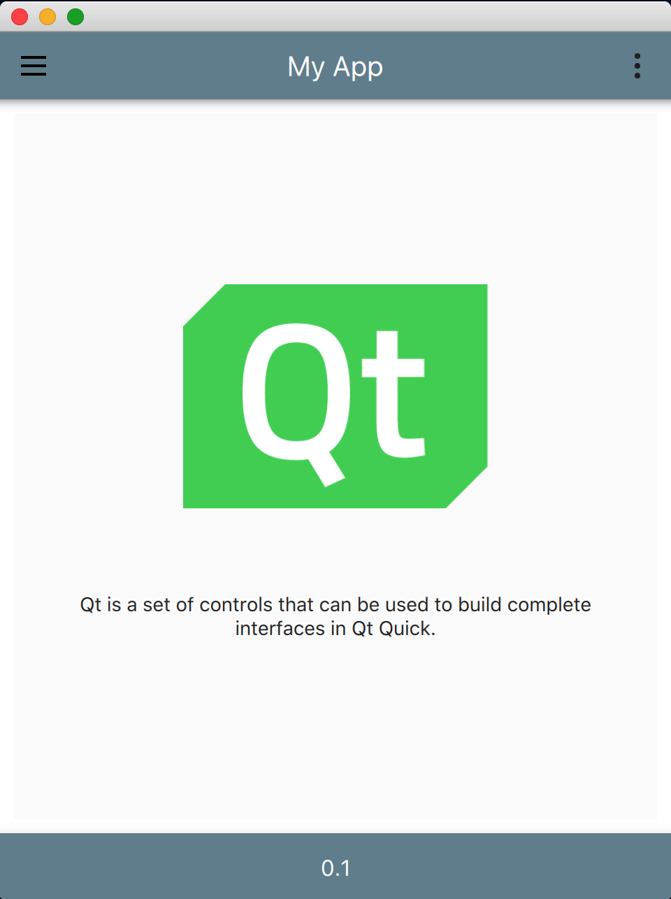
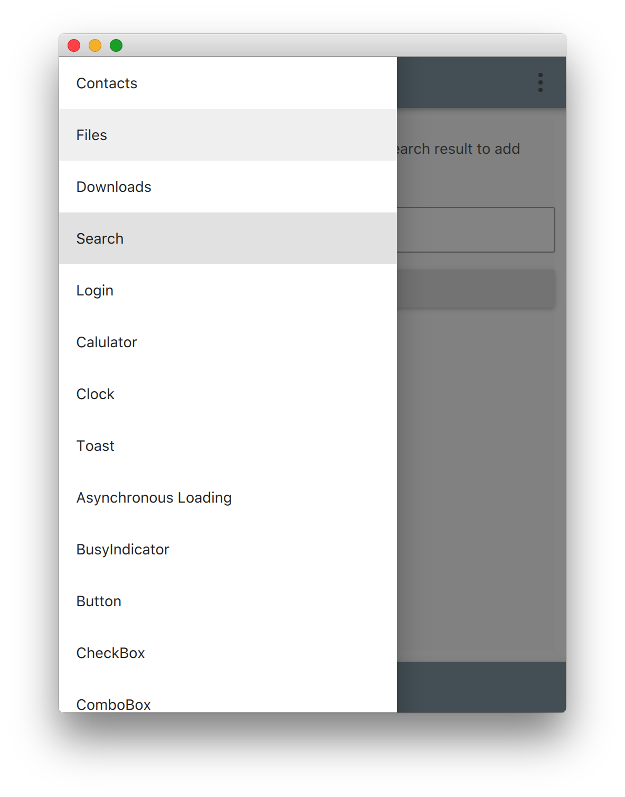
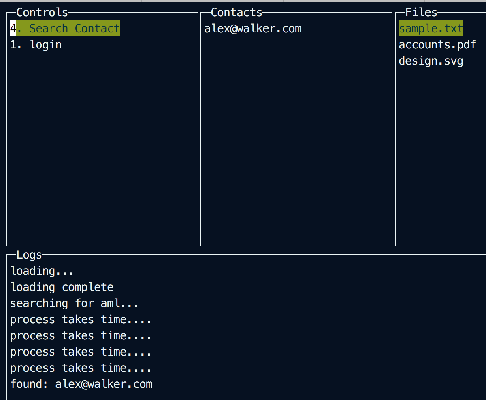
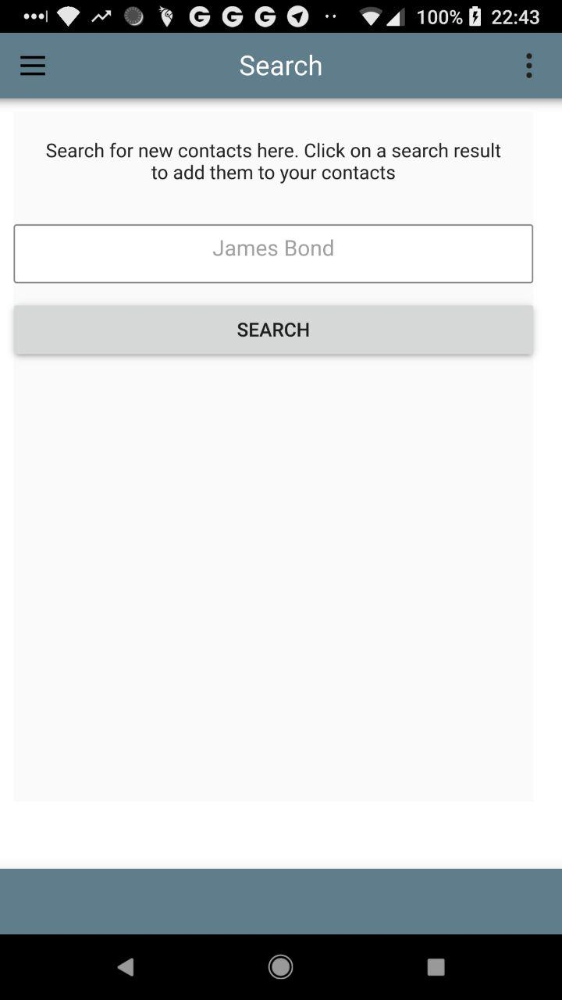

## Got-qt GUI Framework

## Quick Start!

* To use the hotloading feature a configuration file is compiled into the binary using [packr](https://github.com/gobuffalo/packr).
* If you are using the [makefile for automation](MAKEFILE.md), running `make install` should setup everything up for you, including packr.
* Once installation is successful, to build the config.json into the binary, just run `packr` from within the qt directory of this repository. Any time you change the config.json file, found in configfiles/ you will need to re run packr.
	* I have intentionally excluded packr files from the git repository as they can get large and are easily generated.

## General Overview

If you are not interested in manual building and general information (everything below here), you can proceed to [automated building](MAKEFILE.md)

## More background

This is a framework to make desktop/mobile applications in Go with a GUI written in Qt Qml. Both of these languages are cross platform. Go is an open source programming language, Qt is licensed under [LGPL license](https://www1.qt.io/qt-licensing-terms/). In some instances you will need to buy a commercial Qt license - for instance a statically compiled, commercial app, would need a commerical Qt license.
The license for my work here however, is under [MIT license](LICENSE.txt).

Home              |  Menu |  Console UI |  Android
:-------------------------:|:-------------------------:|:-------------------------: |:-------------------------:
 |  |  | 


It uses the Material framework from Google for the UI in Qml, and uses Go as a backend. It demonstrates making pages in Qml, interfacing with the backend Go code, and receving messages from the backend. I.e everything you need to build a desktop app, all ready to go.

I built this because I was building desktop apps in Go, with Guis. For every change I made, i had to recompile the go code even if I was just changing the UI code. This takes a long time. It _can_ be sped up, however I wanted to develop my UI faster. I could have used qt-creator, however it was another IDE, I just wanted an easy way to build desktop apps with Go.

So I added hotloading to the qml files. You can download the [demo OSX app here.](qtapp.zip)

* [Follow me on twitter](https://twitter.com/amlwwalker)
* [Read the medium post](https://medium.com/@_whitesilence/building-compiled-fast-cross-platform-desktop-apps-in-go-with-qml-a5bb347f4ce9)

##### Watch the [youtube video](https://youtu.be/38gvNBT6VlM)

##### Please note this is in early stages

### What I wanted:

* Wanted to make desktop applications that were as easy to use for anyone who could use a computer. (No web app, no console app etc etc)
* Wanted to write it in a cross platform language so that I would only need to write it once
* Use a language I was already familiar with
* From research, there were a few options for the UI, for instance HTML/CSS/JS. However this required use of the installed default web browser and I didn't want to rely on that, but also it meant that the UI files had to be shipped around with the application. Felt a little messy and like using the wrong tool for the job. Besides, its slow :)
* Qml seemed very well documented and when I discovered the work of [therecipe](https://github.com/therecipe/qt) I felt like I was solving alot of problems related to cross platform app development in one go.
* With go compiling the qml into the application as binary, the UI is very fast.
* The Go Material UI theme is included in QT which sped up UI development.

This is a combination of a lot of work done by alot of people around the web. I am very pleased that I have now, what I think, is a very workable framework for building apps cross platform.

## Installation

I am assuming you are a Go developer already and have Go installed with your GOPATH set, etc etc... I am using MacOS so I will put steps for that, however I am linking to where to find installation instructions more generally.

I do however hope you are not a Windows developer... Your paths, your consoles, your docker installations... all will have caveats...

### Installing QT

You can install QT by following the instructions [for regular installation](https://github.com/therecipe/qt/wiki/Installation#regular-installation), however in essence :

`brew install qt5`

This will install the packaged version of Qt. Its a sort of minimal version to get Qt working easily for OSX. However it is not the official version and does not have support for iOS or Android. That's fine as I am using the docker containers to build for other platforms, but it will lead to a minor step you have to take when building for other platforms

### Installing Qt Go-Binding

You can install Qt binding by following [these instructions](https://github.com/therecipe/qt/wiki/Installation-on-macOS#installing-binding), however in essence:

* `go get -u -v github.com/therecipe/qt/cmd/...`
* `$GOPATH/bin/qtsetup`

### Installing Material theme

Luckily Qt comes with the theme installed! No need to do anything here!

### Test everything,

* Because we will later want to cross compile for other OS except OSX, we cannot set a global path to Qt as it will affect the build later for other OS. So before compiling, make sure you have run `export QT_DIR=/usr/local/opt/qt` in the current terminal session. You will need to re run this for each new terminal session otherwise the **build will fail**.

You can run the example code found [here](https://github.com/therecipe/qt/wiki/Getting-Started#starting-application), but in essence, put the following in your `$GOPATH/src` somewhere and run `qtdeploy test desktop`

```
package main

import (
	"github.com/therecipe/qt/widgets"
	"os"
)

func main() {
	// Create application
	app := widgets.NewQApplication(len(os.Args), os.Args)

	// Create main window
	window := widgets.NewQMainWindow(nil, 0)
	window.SetWindowTitle("Hello World Example")
	window.SetMinimumSize2(200, 200)

	// Create main layout
	layout := widgets.NewQVBoxLayout()

	// Create main widget and set the layout
	mainWidget := widgets.NewQWidget(nil, 0)
	mainWidget.SetLayout(layout)

	// Create a line edit and add it to the layout
	input := widgets.NewQLineEdit(nil)
	input.SetPlaceholderText("1. write something")
	layout.AddWidget(input, 0, 0)

	// Create a button and add it to the layout
	button := widgets.NewQPushButton2("2. click me", nil)
	layout.AddWidget(button, 0, 0)

	// Connect event for button
	button.ConnectClicked(func(checked bool) {
		widgets.QMessageBox_Information(nil, "OK", input.Text(),
		widgets.QMessageBox__Ok, widgets.QMessageBox__Ok)
	})

	// Set main widget as the central widget of the window
	window.SetCentralWidget(mainWidget)

	// Show the window
	window.Show()

	// Execute app
	app.Exec()
}
```

If you get a window appear once the compilation completes (it may take a moment) then everything is working and you can continue. If you have any issues, read the [wiki page](https://github.com/therecipe/qt/wiki/Getting-Started#starting-application).

### Installing this project

Now your environment is ready, to make app development easy, you can use this project Got-qt. For the sake of argument, I am setting an env var for the project name so I can refer to it elsewhere.

prerequisite. So that the instructions are general for all platforms:
* MacOS:`export OSTYPE=darwin`
* Windows:`export OSTYPE=windows`
* Android:`export OSTYPE=android`

* `export PROJECTNAME=myproject`
* `cd $GOPATH/src/amlwwalker`
* `git clone https://github.com/amlwwalker/got-qt`
* `cp -r got-qt $PROJECTNAME`
* `cd $PROJECTNAME`

* Update the path in qt/main.go stored as the variable `topLevel` to the new path of your project. This is an absolute build path currently set to this project, as opposed to yours.
* Remember to update any paths to backend business logic in your own projects, otherwise will only know about logic in this project

* `cd qt` `#Need to compile from within here`
* `qtdeploy test desktop`

At this stage, the application will build and run. It will take a bit of time. If you get the sample app appearing then great, compilation has been successful.

### Help/Demo

* (Tip: Turn on english subtitles)

[To see the above process in action, I have added a youtube video here to give you an idea](https://youtu.be/T96KOy4sTJ8)

**Read on for how to develop apps efficiently and easily**

## Using the framework

Reasons to use this

* Fast setup of cross platform GUI apps with a Go backend
* Efficient developing. Compiling QML and Go requires C bindings which is slow
* Good code management. This projects demonstrates decoupling of backend logic from frontend allowing headless, web-based, console, or gui applications to all share the same logic, yet not know about each other.

There is a configuration file that tells the application whether to run in hotloading mode. If it is run in hotloading mode, then it will continually monitor changes to its own qml files and update the user interface immediately. Makes for real time development.

* In the case of hotloading, the app must be run directly from the terminal. This is so that it can detect local configuration. Double clicking the app in Finder runs it under the Finder's environment which is not the same as the developers and will therefore not have hotloading enabled.
* Run with `GOPATH/src/$USER/$PROJECTNAME/deploy/darwin/got-qt/Contents/MacOS/got-qt`
* This will allow it to detect the config for hotloading and QML will update in realtime.

My recommended approach is to build your UI using this in QML, then decide how it needs to interface with the Go code (backend). Once you know those requirements, you can add in the listeners in the Go code and have basic interaction with the front end, proving to your self you have two way comms. Use this two way comms to set the needed bridge connections up, but forget about functionality for now. Just confirm you have the commnunication working.

Then, move to building a console UI. There is a demonstration console UI using the amazing [gocui](https://github.com/jroimartin/gocui). Its a very straight forward way of building great console applications in Go. I recommend this for a few reasons:

* Building apps with console UI's compile much faster than with GUIs
* Building a console app allows you to work out what logic you are going to require, with the intent of keeping it seperate from the UI - I.e better architecture.
* It is educational as to how frontends and backends communicate, which is useful when designing your GUI. For instance, how are you going to handle processes that take a long time, the user needs to be notified. They also shouldn't experience lock up. How do you handle these things.

The directory `cuiinterface` shows how this decoupling of the console UI works. Whats great is because nothing else knows about anything in this directory, it won't get compiled into the application when the GUI is compiled. I recommend this same structure for all your UIs (i.e each having its own directory and nothing else knows about it).

Once the console UI you have built demonstrates the functionality required by the go code, you can then wire up your GUI to the same functions (as the two UI's are just top level interfaces to the backend), and save yourself a lot of compilation time.

## Steps

### Development

1. In config.json, make sure that hotloading is set to true
	* **Please Note** hotloading must be disabled when in production mode and on mobile devices
2. Make sure you have run `packr` in the `qt/` directory Whenever a change to config.json is made
2. Run the application with `GOPATH/src/$USER/$PROJECTNAME/deploy/darwin/got-qt/Contents/MacOS/got-qt`
3. Navigate with your editor of choice to `qml/` - this is where all the UI files are kept.
4. For now you will be editing loader.qml. This file is configured for hotloading. loader-production.qml is for when the code is to be compiled into the application for deployment. This is necessary because the finder app runs under a different user space to you.
5. Start editing loader.qml. You will see the UI update as you save.
	* You can edit any of the files under pages/elements and they will be updated automatically.
	* Notice on occasion restarts of the app (but not recompilation) will be required if you break the qml it cannot rebuild it. Just quit and restart easy.

**NOTICE** If you import new libraries into your qml, then in this case a recompile will be required as those libraries won't have been compiled into the application, this only needs to happen once per new library imported however. Shouldn't be too frequent.

### Production

6. When you are ready for production:

* copy loader.qml to `loader-production.qml`
* Update any relative path in `loader-production.qml` to a qrc path so that the app knows how to find the compiled qml, e.g:
* Update any relative path to a qml file to a qrc path.

##### Relative:

```
ListElement { title: "Contacts"; source: "pages/_contactsPage.qml" }
ListElement { title: "Files"; source: "pages/_filelistPage.qml" }
ListElement { title: "Downloads"; source: "pages/_downloadsPage.qml" }
```

##### Qrc:

```
ListElement { title: "Contacts"; source: "qrc:/qml/pages/_contactsPage.qml" }
ListElement { title: "Files"; source: "qrc:/qml/pages/_filelistPage.qml" }
ListElement { title: "Downloads"; source: "qrc:/qml/pages/_downloadsPage.qml" }
```
(this step will in time be improved, its a bit annoying to have to do with a find/replace, but ListElements can't have dynamic paths in qml)

* set hotloading to false in config.json and recompile. You can recompile now with `qtdeploy build desktop`
* Navigate in Finder to your `deploy/$(OSTYPE)` directory and double click the application. It should start up with your changes with your changes compiled in.

### Cross Compilation

Using [therecipe/qt](https://github.com/therecipe/qt/wiki/Deploying-macOS-to-Windows-32-bit) tools and using docker, its very easy to cross compile for different platforms, but in essence:

* Install docker for your [platform i.e OSX](https://docs.docker.com/docker-for-mac/install/#download-docker-for-mac)
* Pull the docker container for the platform you want to cross compile for

`docker pull therecipe/qt:windows_32_shared`

* Build for the platform

`qtdeploy -docker build windows_32_shared`

* You can follow the instructions for different devices such as linux, [here](https://github.com/therecipe/qt/wiki/Deploying-macOS-to-Linux). Other devices are documented there aswell.

##### NOTICE: I have only cross compiled for windows and android, but the steps should be the same for other platforms if you have docker installed.

* You will have the application build in `deploy/platform` directory in `qt/`

##### NOTICE: When cross compiling, to be in a terminal session where you did not run `export QT_DIR=/usr/local/opt/qt` first

### Device Specific Setup

#### Android

In the android/ directory there is the configuration to setup the android app. There is an AndroidManifest.xml where things like the App Name, and the device permissions live. Inside android/res/drawable there is an icon.png file that will set the app icon.

#### OSX

Inside the darwin directory, there is Contents/Resources. Inside here you can create the app icon. To do so, you need to put the icon files inside icons.iconset directory (keeping the names for the files the same), where you can put the icon. Then from inside darwin/Contents/Resources, run `iconutil -c icns icons.iconset` to generate the icons.icns file which will be used for the app icon. The info.plist file contains the configuration for OSX.


## To do

* Tidy up hotloading.
* iOS untested
* Create a Windows Installer because otherwise the end user has to see a whole load of messy qml files as part of the application.


